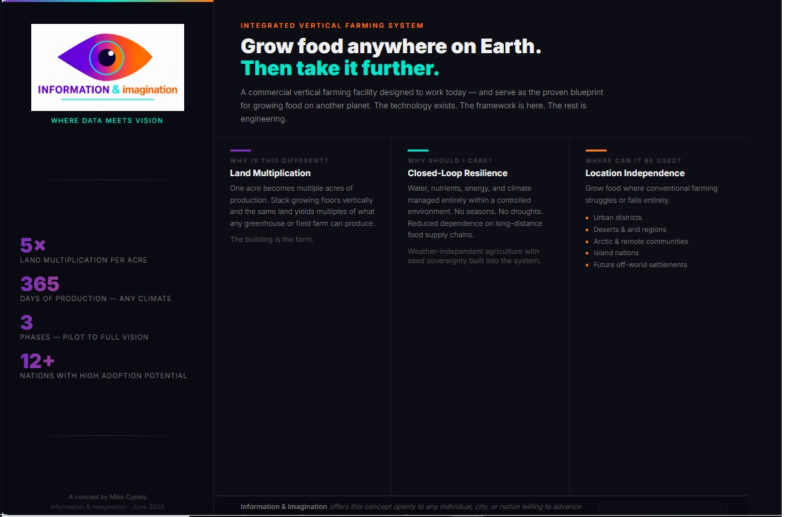

# Integrated Vertical Farming System

A concept for a multi-story, closed-loop farming facility designed to multiply productive land area, reduce dependence on climate and geography, and provide a practical blueprint for future off-world agriculture.

The project combines existing technologies—including controlled-environment agriculture, automation, robotics, sensor networks, water recirculation, and renewable energy systems—into a single scalable architecture capable of producing food in locations where conventional agriculture struggles or fails.

## Core Principles

- Land Multiplication
- Closed-Loop Resilience
- Location Independence
- Seed Sovereignty
- Open and Repairable Systems

"The building is the farm."

## Status

This is currently a concept and design study.

The goal is to explore how existing technologies can be combined into a scalable agricultural platform. The project is not seeking investment, patents, or exclusivity. The concept is shared openly for discussion, improvement, and implementation by anyone who finds value in it.

## Documents

- [Full Proposal (PDF)](IVFS_Proposal_v1.0_2026-06.pdf)
- [Full Proposal (Markdown)](IVFS_Proposal_v1.0_2026-06.md)
- 

